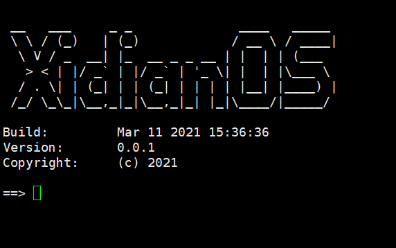

<!--
 * @Author: spaceman
 * @Date: 2021-03-01 17:08:09
 * @LastEditTime: 2021-03-05 18:20:41
 * @LastEditors: spaceman
 * @Description:
 * @FilePath: \XidianOS\README.md
-->
# XidianOS
A micro-kernel operating system that is friendly to AI frameworks.

西电OS操作系统是应用于微处理器上的一个小巧玲珑的操作系统，它可以根据具体的应用场景以去定制化功能，具有较强的可拓展性和可移植性。同时具有一套面向AI模型的标准化框架，可对接多种AI后端推理方案，为用户提供统一的接口。

## AI Framework中间件
作为一个可定制化的操作系统中间件，位于components目录下，若有使用需要可自行添加至工程目录中。

AI Framework目的在为多种不同的神经网络推理后端提供统一的使用接口，只需要对应的插件就可以运行。其中使用Microinfer推理框架，可针对不同芯片平台和模型，一键式直接生成定制化的插件，让用户无需关注模型推理的底层实现。

### API介绍：

模型注册：  xd_ai_register

模型查找：  xd_ai_find

模型初始化： xd_ai_init

模型运行：  xd_ai_run

模型输出：  xd_ai_output

### 示例：
位于AI_Framework文件夹下的app.c展示了如何使用API去运行mnist模型

## 体验 XidianOS
### 基于STM32F103
打开XidianOS->board->ALIENTEK_STM32F103_NANO/keil下的工程

编译下载程序至开发板中,可以看到三个LED灯以不同频率交替闪烁：

并再观察串口助手（波特率115200），可以运行shell命令：

### 基于STM32H750

打开XidianOS->board->WEACT_STM32H750/keil下的工程，编译下载程序至开发板中,可以看到LED灯一直在闪烁，再观察串口助手（波特率115200），可以运行shell命令：

## 内核功能
初步计划支持以下功能：
- [x] 信号量
- [ ] 互斥锁
- [ ] 消息队列
- [ ] 邮箱
- [ ] 支持malloc
## 架构支持
初步计划支持以下架构：
- [x] cortex-m3
- [ ] cortex-m4
- [x] cortex-m7
- [ ] cortex-a (MMU)
## 组件支持
初步计划实现以下组件：
- [x] shell
- [x] letter-shell
- [x] tensorflow
- [x] lvgl
## AI插件支持
- [x] tensorflow-lite micro
- [x] nnom
- [x] onnx
- [x] microinfer
## 修复BUG

- [x] 需添加时间片轮转机制
- [x] 添加定时器
- [x] 需修改systick中处理延时的方式

## 预期设想

- [ ] 简洁的创建静态和动态线程的机制
- [ ] 类似于fork的创建线程的机制
- [ ] 对线程pid号进行管理的机制

## 移植指南

### 对于Keil工程
* 使用Cubemx工具，针对目标处理器和外设生成keil工程
* 添加kernel目录下的.c文件及对应arch下的.c和.s文件，并指定编译所需的头文件路径
* 自行实现uart.c中的串口打印函数以及中断处理函数
* 需要根据具体硬件自己实现 `void xd_kprint_port(xd_uint8_t *ch)` 函数，该函数用于内核输出函数`void xd_kprintf(const char *fmt, ...)`
* 在stm32xxx_it.c中在`void PendSV_Handler(void)`前添加`__weak`
* 根据项目需要添加components下的组件